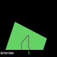

# CarRacingRL
CarRacingV3 with RL training

Inspried by exercise 01 in [Lecture: Self-Driving Cars](https://uni-tuebingen.de/fakultaeten/mathematisch-naturwissenschaftliche-fakultaet/fachbereiche/informatik/lehrstuehle/autonomous-vision/lectures/self-driving-cars/)

All codes are manually typed (no LLM assisted anywhere)

Goal:
- [x] Reference links for every code
- [x] Train a simple model with imitation learning
- [ ] Train MultiClass prediction model (1.2.b)
- [x] Formulate as regression target and re-train (1.2.c)
- [x] Implement Deep Q-Network and Deep Q-Learning
- [x] Investigate influence of discount factor
- [x] Implement Double Q-Learning
- [ ] Write report and blog

### Some visualizations
Imitation learning with 2 epochs: 
DQN with 5000 steps: 

### Notes
- Training 1 epoch (Adam, lr = 1e-5) for simple model yields normal results in first 400 steps. After 400 steps, the car stops moving
  => Training with 2 epochs fix. A simple explanation is the model underfit with 1 epoch.
